# RealityBet — AI-Resolved Prediction Market on GenLayer

**Live demo:** [https://reality-bet.vercel.app](https://reality-bet.vercel.app)


Decentralized YES/NO prediction market where GenLayer validator consensus settles real-world events using live web data. Anyone can create a market; bettors stake GEN in parimutuel pools; an AI resolver fetches the primary source and judges the outcome; validators independently re-verify; winners claim payouts.

## Screenshots

| | |
|---|---|
| 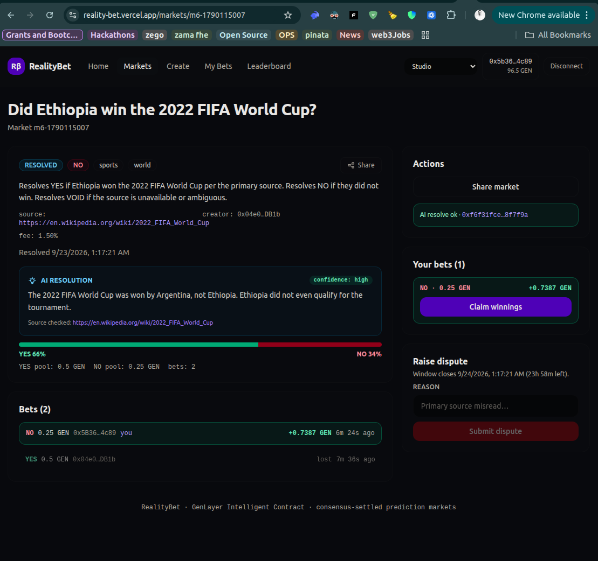 | 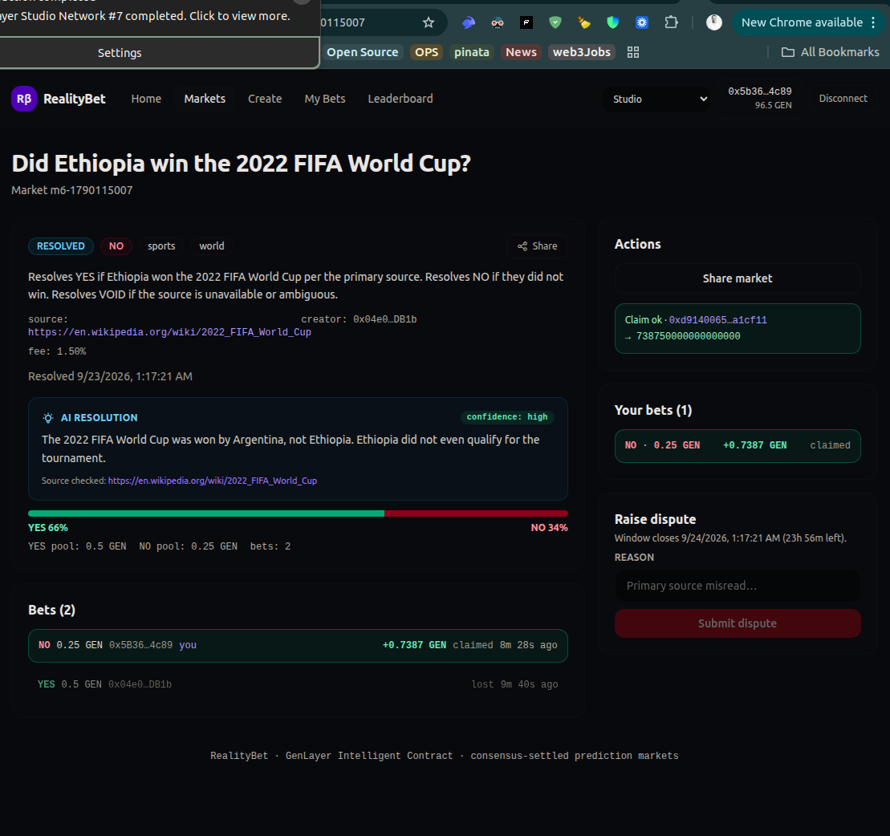 |
| 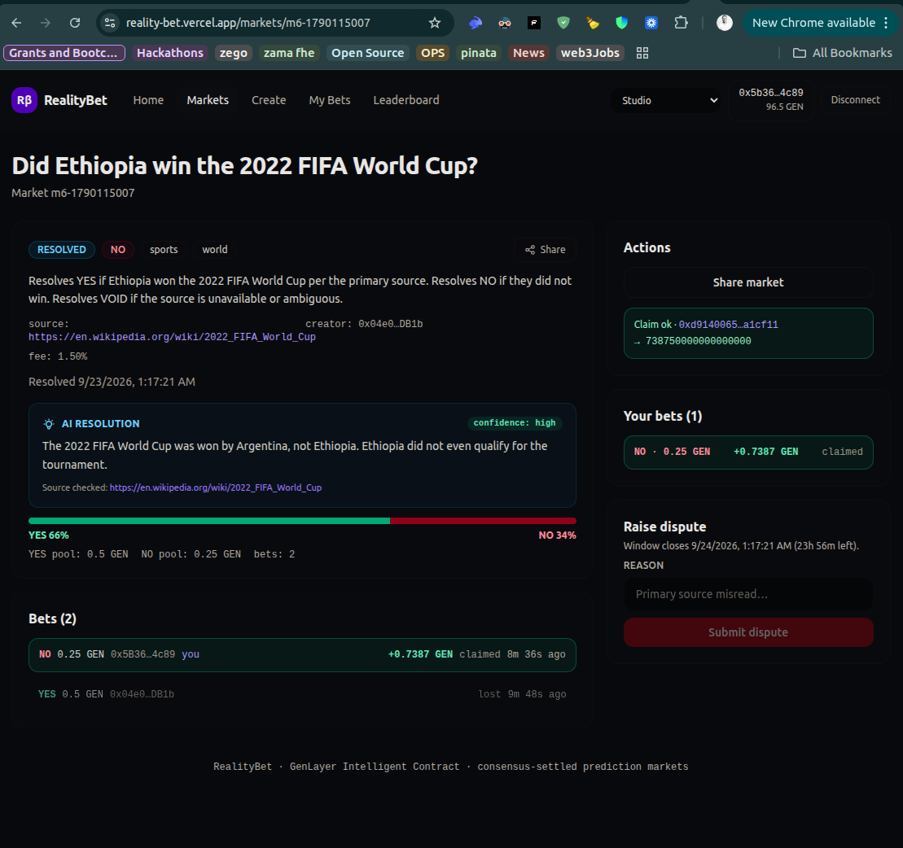 | 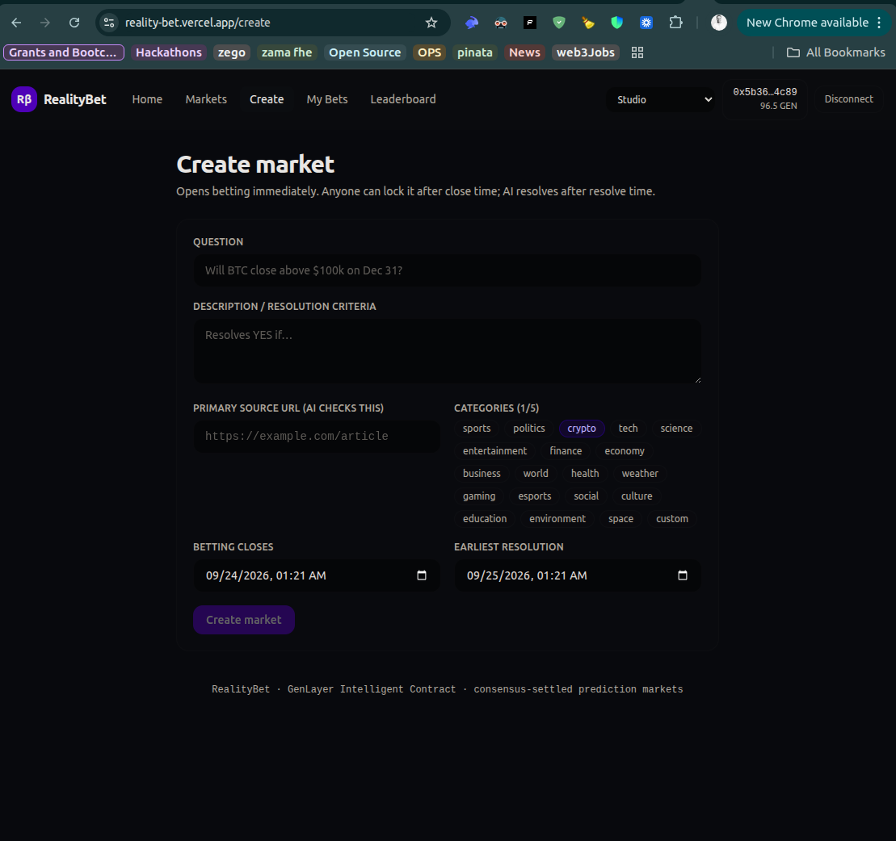 |
| 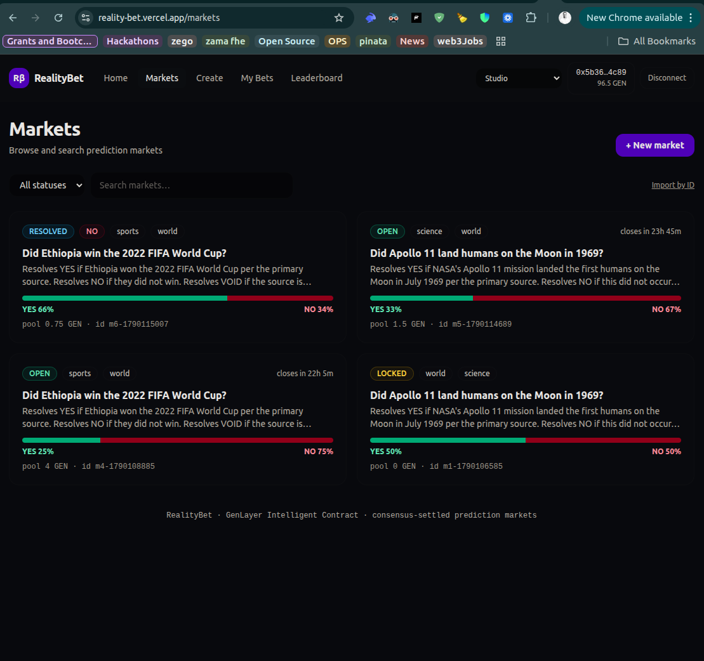 | 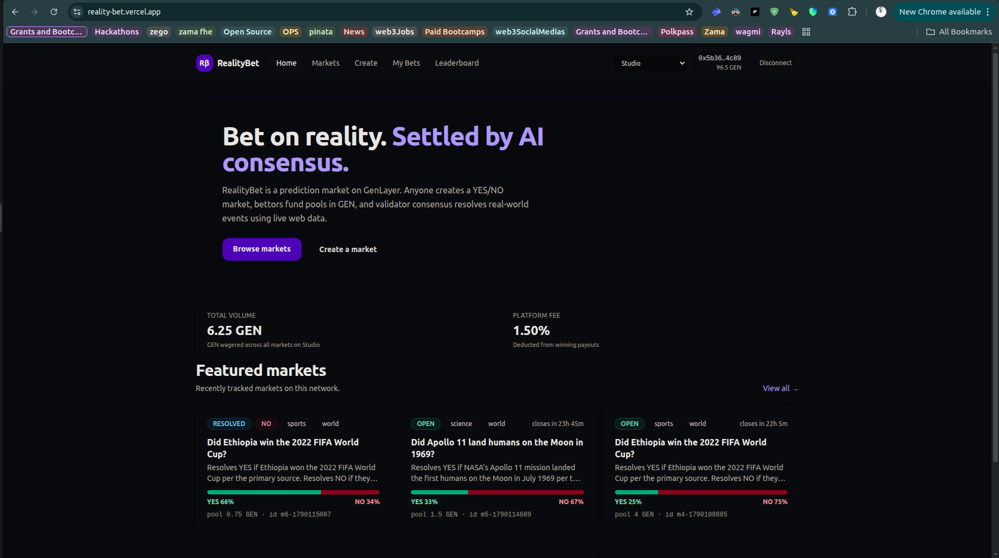 |
| 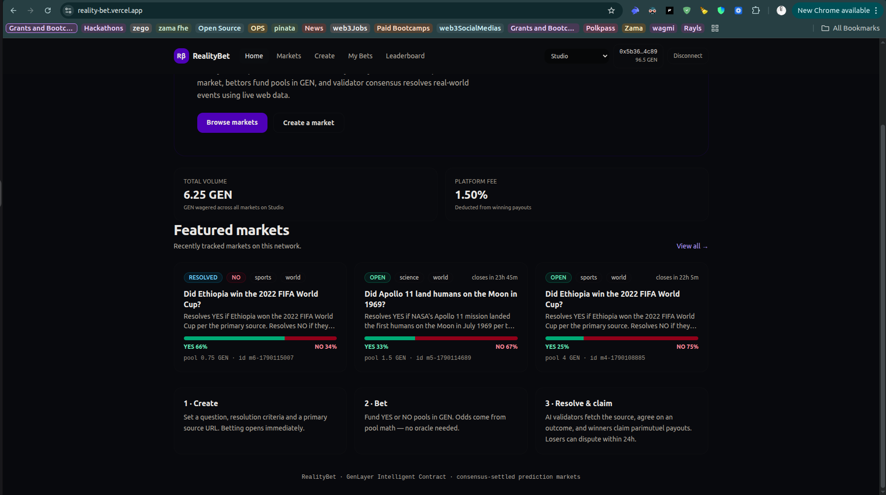 | 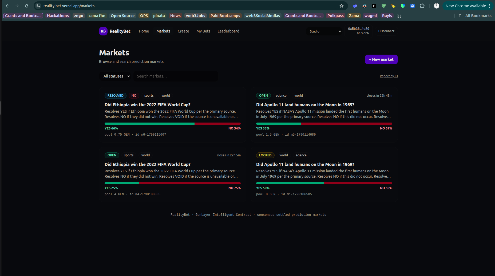 |
| 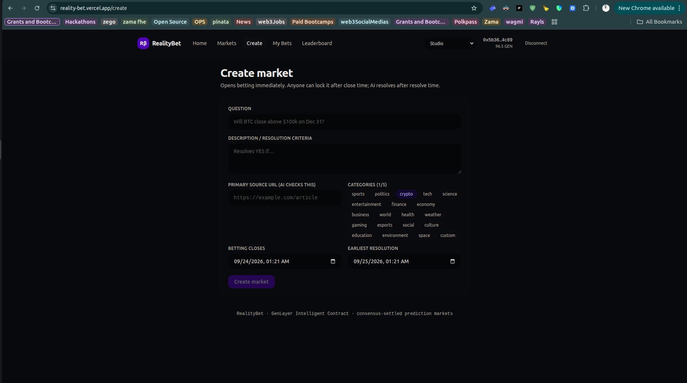 | 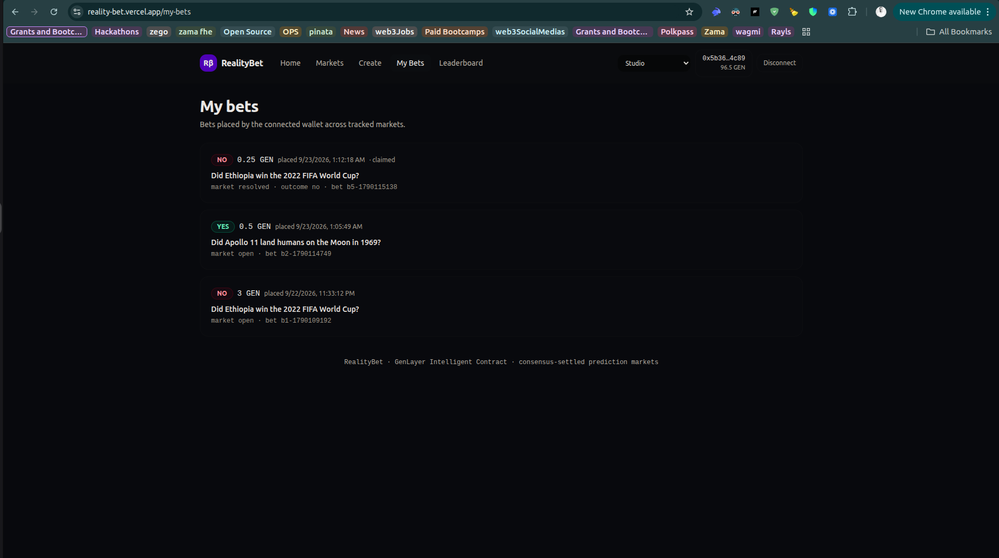 |
| 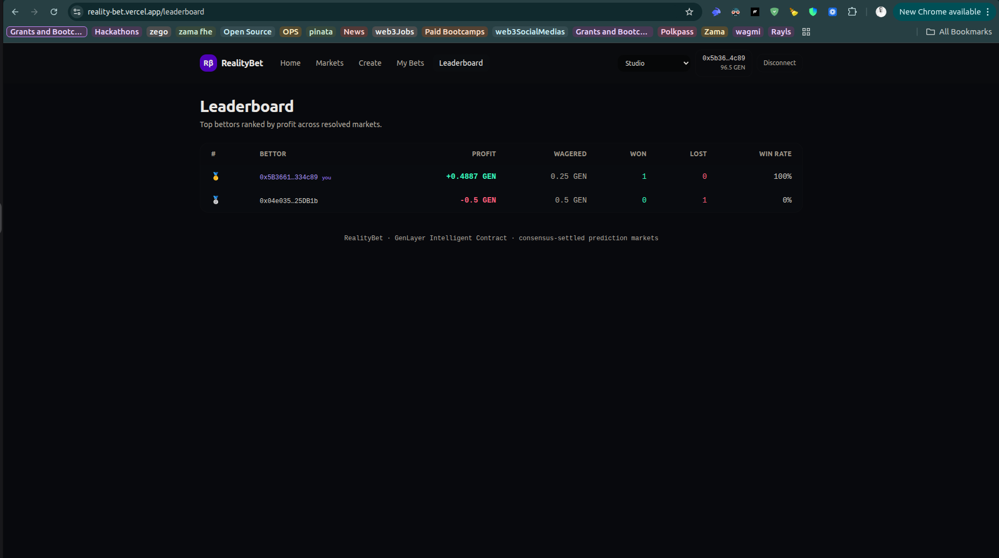 | |

---

## Table of contents

- [How GenLayer consensus is used](#how-genlayer-consensus-is-used)
- [Screenshots](#screenshots)
- [Market lifecycle](#market-lifecycle)
- [Payout formula](#payout-formula)
- [Contract API](#contract-api)
- [Resolution & dispute flow](#resolution--dispute-flow)
- [Frontend](#frontend)
- [Project structure](#project-structure)
- [Getting started](#getting-started)
- [Testing](#testing)
- [Linting](#linting)
- [Deployment](#deployment)
- [Example market](#example-market)
- [Key design decisions](#key-design-decisions)

---

## How GenLayer consensus is used

Resolution runs inside `gl.eq_principle.prompt_comparative`:

1. The **leader** fetches `resolution_url` via `gl.nondet.web.get`, truncates the body, and runs `gl.nondet.exec_prompt` asking the LLM for strict JSON: `{outcome, confidence, reason, sources_checked}`.
2. **Validators** independently re-fetch the same URL and re-run the LLM prompt.
3. The `EqComparative` template accepts the result only if `outcome` matches **exactly** across validators — no `strict_eq` on free-form LLM text, no schema-only checks.

**Defensive post-processing** (protects bettors):

- JSON parse failure → market **VOIDED**
- Key aliasing for common LLM variants (`outcome|result|verdict`, `confidence|conf`, etc.)
- `confidence == "low"` with a non-void outcome → forced **void**
- Invalid outcome value → **void**

On success, the market stores `resolver_confidence` (high/medium/low) and `resolver_sources` (JSON array) alongside `resolver_note`, all surfaced via `get_market` for the UI.

Contract pins its runner: `# { "Depends": "py-genlayer:1jb45aa8ynh2a9c9xn3b7qqh8sm5q93hwfp7jqmwsfhh8jpz09h6" }`

---

## Market lifecycle

```
OPEN ──► LOCKED ──► RESOLVED ──► claims (winners / losers / void refunds)
  │          │           │
  │          │       24h dispute window
  │          │           │
  │          │       DISPUTED ──► RESOLVED  (owner ruling or AI re_resolve)
  │          │
  └──────────┴──► VOIDED ──► refunds
```

| State | Meaning |
|---|---|
| `open` | Accepting bets (and optional `fund_market` liquidity) |
| `locked` | Betting closed after `close_time`, awaiting resolution |
| `resolved` | Outcome finalized; claims open |
| `voided` | Cancelled — full refunds, no fees |
| `disputed` | Resolution challenged within 24h of `resolved_at` |

---

## Payout formula (u256 only)

```
gross = bet * total_pool // win_pool
fee   = gross * fee_bps // 10000        # fee_bps snapshotted per market (default 150 = 1.5%)
net   = gross - fee
```

- **WIN** → `net` paid to bettor via `emit_transfer`; `fee` paid to owner
- **VOID** → full refund of `bet`, no fee
- **LOSER** → 0

**Example:** pools 6 YES / 4 NO (total 10), bet 1 YES → gross `1×10//6 = 1.667`, fee 1.5% → net ≈ `1.642` GEN.

---

## Contract API

Single contract: [`contracts/RealityBet.py`](contracts/RealityBet.py) — class `RealityBet(gl.Contract)`, 26 public methods.

### Storage

| Field | Type |
|---|---|
| `markets`, `bets`, `disputes` | `TreeMap[str, Market/Bet/Dispute]` |
| `market_bets`, `bettor_bets` | `TreeMap[str, DynArray[str]]` |
| `owner` | `Address` |
| `platform_fee_bps`, `total_volume`, counters | `u256` |

**Market** includes multi-tag `categories: DynArray[str]` (20 categories: sports, politics, crypto, tech, science, entertainment, finance, economy, business, world, health, weather, gaming, esports, social, culture, education, environment, space, custom — 1–5 tags, deduped), `resolution_url`, pools, status, and resolver metadata (`resolver_note`, `resolver_confidence`, `resolver_sources`).

### Write methods

| Method | Auth | Description |
|---|---|---|
| `create_market(title, description, resolution_url, categories, close_time, resolve_time)` | anyone | Create market; validates future close, `resolve ≥ close`, valid categories |
| `lock_market(market_id)` | anyone after `close_time` | `OPEN → LOCKED` |
| `void_market(market_id)` | creator / owner | `OPEN/LOCKED → VOIDED` |
| `fund_market(market_id)` *(payable)* | anyone while `OPEN` | Splits sent GEN half YES / half NO (bootstrap liquidity) |
| `place_bet(market_id, side)` *(payable)* | anyone before close | Stake GEN on `yes` or `no`; updates pools + `total_volume` |
| `claim_winnings(bet_id)` | bettor | Payout after `RESOLVED` (win / void refund / 0) |
| `refund_void(bet_id)` | bettor | Full refund after `VOIDED` |
| `request_resolution(market_id)` | anyone after `resolve_time` | Runs AI `_resolve` on a `LOCKED` market |
| `force_resolve(market_id, outcome, note)` | owner | Emergency override (`LOCKED/DISPUTED`) |
| `raise_dispute(market_id, reason)` | bettor ≤24h post-resolution | `RESOLVED → DISPUTED` |
| `resolve_dispute(dispute_id, upheld, new_outcome, note)` | owner | Uphold (may flip outcome) or reject |
| `re_resolve(market_id)` | owner | Re-run AI resolution on a disputed market |
| `set_fee(bps)` | owner | Max 500 (5%) |
| `transfer_ownership(new_owner)` | owner | Transfer admin |

### View methods

`get_market` · `get_market_ids(offset, limit)` · `get_markets_page(offset, limit)` (newest-first, cap 50) · `get_bet` · `get_market_bets_detailed` · `get_bets_by_bettor` · `get_dispute` · `get_market_bets` · `get_bettor_bets` (0x-normalized) · `get_odds` · `get_market_stats` · `get_platform_stats`

IDs are sequential: `m{count}-{ts}`, `b{count}-{ts}`, `d{count}-{ts}`. Time comes from `datetime.now(timezone.utc)`; errors use `raise gl.vm.UserError(...)`.

---

## Resolution & dispute flow

```
request_resolution / re_resolve
        │
        ▼
   _resolve(market_id)
        │
        ├─ builds prompt (title, description, criteria, resolution_url, categories)
        │
        ├─ def _fetch():
        │     gl.nondet.web.get(url)           # primary source
        │     gl.nondet.exec_prompt(...)       # LLM → strict JSON
        │
        └─ gl.eq_principle.prompt_comparative(
               _fetch,
               "`outcome` must be exactly the same. ..."
             )
                    │
                    ▼
        defensive parse → RESOLVED | VOIDED
```

Disputes: a bettor has **24h** after `resolved_at` to `raise_dispute`. The owner can `resolve_dispute` (uphold / reject) or `re_resolve` to re-run the AI with fresh web state. `force_resolve` is the last-resort manual override.

---

## Frontend

React **19** + TypeScript + **Vite** + **Tailwind CSS 4** + **react-router-dom 7** + **genlayer-js**.

| Route | Page |
|---|---|
| `/` | Home |
| `/markets` | Browse markets |
| `/markets/:id` | Market detail, odds, place bet, claims, disputes |
| `/create` | Create market form |
| `/my-bets` | User's bets & claims |
| `/leaderboard` | Ranked bettors |
| `/admin` | Owner tools (hidden unless connected as owner) |

**Key libs** (`frontend/src/lib/`):

- `chains.ts` — studionet (default, chain id 61999), Asimov/Bradbury testnets, localnet; explorer: https://explorer-studio.genlayer.com
- `genlayer.ts` — client per network, wallet chain switch, Studio rate-limit guard (500 req/h cooldown), 60s view cache + in-flight dedupe, write receipts polled to `FINALIZED`
- `contract.ts` — typed wrappers; aggregate reads so a page = 1 RPC call
- `market-registry.ts` — on-chain enumeration as source of truth + localStorage pin list / seed markets
- `wallet.tsx` — MetaMask connect, network persistence, wrong-chain detection

**RPC path:** browser → same-origin `/api/rpc` (Vercel rewrite or Vite dev proxy) → `https://studio.genlayer.com/api`.

**Environment** (`frontend/.env.example`):

```
VITE_CONTRACT_ADDRESS=0x5809744633d425b3b419567021510f6B42E5AC60
VITE_NETWORK=studionet
VITE_RPC_URL=            # optional absolute URL or "direct"
VITE_SEED_MARKETS=       # optional comma-separated market ids
```

**Deployed contract:** [`0x5809744633d425b3b419567021510f6B42E5AC60`](https://explorer-studio.genlayer.com/address/0x5809744633d425b3b419567021510f6B42E5AC60) on **GenLayer Studio** (chain id 61999).

---

## Project structure

```
Reality-Bet-Genlayer/
├── README.md
├── SUBMISSION.md              # portal copy-paste notes
├── AGENTS.md                  # architecture & agent-role design doc
├── genlayer_skills.md         # GenLayer build / lint / test / deploy checklist
├── docs/
│   └── images/                # hero + UI screenshots
├── contracts/
│   └── RealityBet.py          # single Intelligent Contract (~570 lines)
├── tests/
│   └── direct/
│       └── test_realitybet.py # 17 direct-mode pytest tests (mocked web + LLM)
└── frontend/
    ├── package.json           # React 19 + Vite + genlayer-js
    ├── vite.config.ts         # /api/rpc → studio.genlayer.com (dev)
    ├── vercel.json            # SPA rewrites + production /api/rpc proxy
    └── src/
        ├── pages/             # Home, Markets, MarketDetail, Create, MyBets, Leaderboard, Admin
        ├── components/        # Header, MarketCard, PlaceBetModal, forms, badges, UI
        └── lib/               # chains, contract, genlayer, wallet, market-registry
```

Conceptual agent roles (see `AGENTS.md`): **MarketAgent** (create/lock/void/fund), **BettorAgent** (bet/claim/refund), **ResolverAgent** (`request_resolution` → `_resolve`), **AuditAgent** (dispute/re_resolve/force_resolve).

---

## Getting started

### Prerequisites

- Node.js 20+
- MetaMask (or any injected wallet) pointed at GenLayer Studio
- For contract tests: Python 3.10+ with [`genlayer-test`](https://github.com/genlayer) installed (provides the `direct_vm` pytest fixtures)
- For contract lint: `genvm-lint`
- For deploy: [GenLayer CLI](https://docs.genlayer.com) (`genlayer`)

### Frontend

```bash
cd frontend
npm install
npm run dev          # http://localhost:5173
```

Optional: copy `.env.example` → `.env` and adjust `VITE_CONTRACT_ADDRESS` / `VITE_NETWORK`.

---

## Testing

Direct-mode tests with **mocked web + LLM** (`direct_vm.mock_web`, `direct_vm.mock_llm`), time travel (`direct_vm.warp()`), and reverts (`direct_vm.expect_revert()`).

```bash
pytest tests/direct/ -v
```

Requires an environment where the `genlayer-test` pytest plugin is active (e.g. a venv with `genlayer-test` installed). 17 tests cover:

- Market creation (single/multi-category, dedupe, invalid reverts)
- Betting, odds, place-bet on both sides
- Lock timing
- Resolve YES/NO payouts, fee split (200 bps), loser = 0
- Void refunds, low-confidence auto-void, duplicate claim revert
- Dispute → uphold / outcome flip
- Pagination (`get_market_ids` newest-first, string-sort edge case)
- `get_market_bets_detailed` ordering
- `get_bettor_bets` 0x / bare-hex address regression

> Note: direct mode runs the **leader only**; full validator consensus runs on-chain.

---

## Linting

```bash
# Contract
genvm-lint check contracts/RealityBet.py --json

# Frontend (oxlint)
cd frontend && npm run lint

# Typecheck (included in build)
cd frontend && npm run build
```

---

## Deployment

### Contract

No in-repo deploy script — use the GenLayer CLI:

```bash
genlayer deploy --contract contracts/RealityBet.py
```

After deploy, update `frontend/.env` (`VITE_CONTRACT_ADDRESS`) and redeploy the frontend.

### Frontend (Vercel)

`frontend/vercel.json` configures:

- SPA rewrites for react-router
- `/api/rpc` → `https://studio.genlayer.com/api` (RPC proxy)

Build command: `npm run build` · Output: `dist/` · Framework: Vite.

Current production: **https://reality-bet.vercel.app**

---

## Example market

**"Will BTC close above $100k on Dec 31 2025?"** — category `crypto`, source: CoinMarketCap. Close `1767139200`, resolve `1767225600`. Pools 6 GEN YES / 4 GEN NO; outcome **YES**: 1 GEN YES → gross 1.667, fee 1.5% → net ~1.642 GEN.

---

## Key design decisions

| Decision | Why |
|---|---|
| **`prompt_comparative` + exact `outcome` match** | Validators must agree on the verdict, not free-form prose; avoids `strict_eq` flakiness on LLM text |
| **Auto-void on low confidence / parse failure** | Protecting bettors from bad resolutions preserves platform trust over forcing a wrong outcome |
| **Parimutuel u256 math** | Natural price discovery from pool ratios; no external odds oracle |
| **24h dispute window** | Enough time for losers to challenge without locking winner funds indefinitely |
| **`re_resolve` on dispute** | Re-running AI with fresh web state beats manual arbitration for most cases; `force_resolve` is the fallback |
| **Multi-tag categories (1–5)** | Markets often span topics (e.g. politics + world); improves discovery |
| **On-chain pagination** | `get_markets_page` / `get_market_ids` scale without client-side full scans |
| **Same-origin `/api/rpc`** | Avoids CORS and hides Studio rate limits behind a single proxy path |
